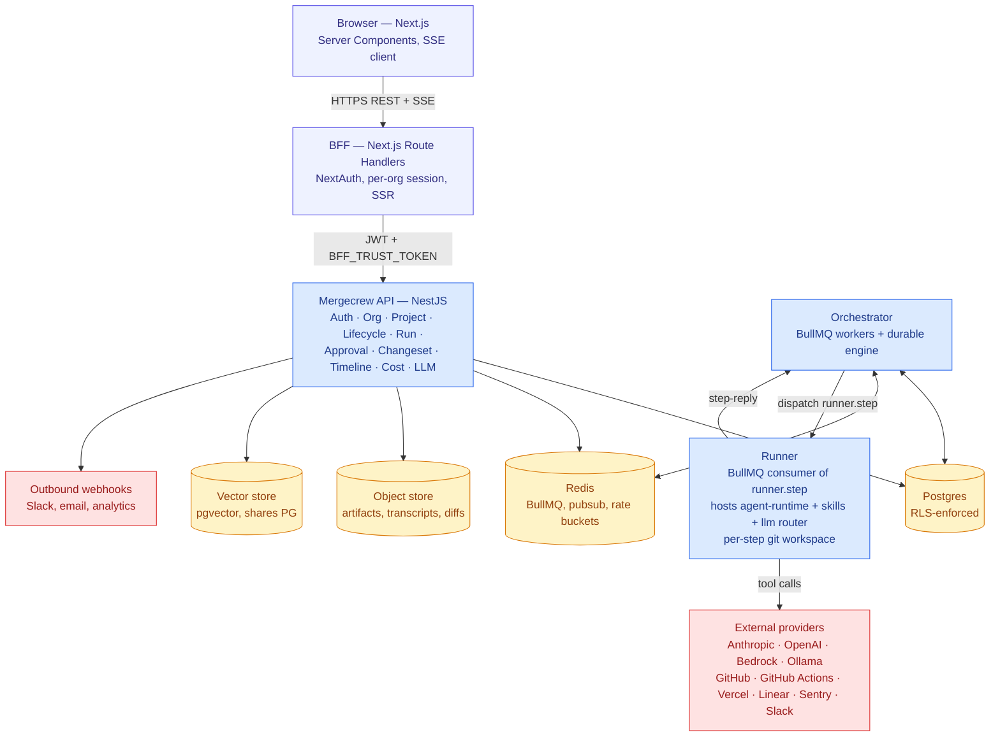
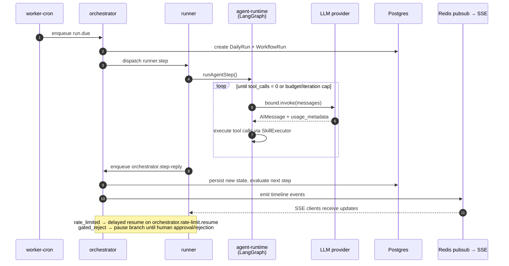

# Architecture overview

## Component map



## Layering

Mergecrew is a layered system. Each layer has a single responsibility and one well-defined interface to the layer below.

| Layer | Concern | Implementation |
|---|---|---|
| **UI** | rendering, input, real-time view | Next.js 16 (App Router) + Tailwind + lucide-react |
| **BFF** | session, per-org guarding, SSR data, SSE proxy | Next.js route handlers; trust-token exchange with API |
| **API** | tenant-aware CRUD, business rules, gate evaluation, cost tracking | NestJS modules (`apps/api`) |
| **Orchestration** | durable run scheduling, retries, rate-limit pause/resume, idempotency | Custom engine on BullMQ + Postgres (`apps/orchestrator`) |
| **Runner** | execute one agent step inside a sandboxed workspace | BullMQ `runner.step` consumer (`apps/runner`) |
| **Agent runtime** | LangGraph StateGraph: agent node ↔ tools node loop | `@mergecrew/agent-runtime` (`packages/agent-runtime/src/loop.ts`) |
| **LLM abstraction** | LangChain `BaseChatModel` factory + capability router | `@mergecrew/llm` (`packages/llm`) |
| **Skill abstraction** | side-effecting capabilities the agent can invoke | `@mergecrew/skills` (`packages/skills`) |
| **Adapter layer** | VCS, deploy, tracker, comms | One package per family under `packages/adapters-*` |

Layers above can call layers below. Below cannot call above (events bubble up via the eventlog; not synchronous).

## Repository layout (monorepo)

```
mergecrew/
  apps/
    web/                  Next.js 16 (App Router)
    api/                  NestJS HTTP + SSE (port 4000)
    orchestrator/         BullMQ workers + custom durable engine
    runner/               BullMQ consumer of `runner.step`
    worker-cron/          Schedule scanner (enqueues `run.due`)
  packages/
    domain/               Zod-shaped domain types & enums
    llm/                  LangChain BaseChatModel factory + CapabilityRouter
    skills/               Skill SDK + ~25 stock skills
    agent-runtime/        LangGraph StateGraph (agent + tools nodes)
    adapters-vcs/         GitHubProvider, GitLabProvider, GiteaProvider
    adapters-deploy/      github-actions, vercel, netlify, render, fly, railway, aws-direct
    adapters-tracker/     LinearProvider, GitHubIssuesProvider
    adapters-comms/       SlackProvider, EmailProvider (SMTP + Resend)
    db/                   Prisma schema, migrations, RLS, withTenant/withSystem
    eventlog/             Append-only timeline event types & repository
    config-yaml/          mergecrew.yaml parser/validator
  infra/
    aws/                  Terraform sketch (not yet wired up)
    docker/               Dockerfiles for api, runner, orchestrator, web, worker-cron
    sql/                  RLS bootstrap + init scripts
```

## Process model

Mergecrew runs as four backend services plus the web app, each independently scalable:

- `web` — Next.js, stateless, autoscales on request count. Port 3000.
- `api` — NestJS HTTP + SSE, stateless, autoscales on request count. Port 4000.
- `orchestrator` — Six BullMQ workers (`run.due`, `orchestrator.dispatch`, `orchestrator.gate.resume`, `orchestrator.rate-limit.resume`, `webhook.inbound`, `orchestrator.step-reply`). State lives in Postgres; multiple replicas can run in parallel because BullMQ guarantees per-job exclusivity. See `apps/orchestrator/src/main.ts:23-57`.
- `runner` — BullMQ consumer of `runner.step` (default `RUNNER_CONCURRENCY=4`). The only process that holds an LLM client and a per-step git workspace. See `apps/runner/src/main.ts`.
- `worker-cron` — Polls `Schedule` rows on an interval (`WORKER_CRON_TICK_MS`, default 60s) and enqueues `run.due` jobs when a project's cron is due. See `apps/worker-cron/src/main.ts`.

## Data flow: a run, end to end



1. `worker-cron` finds a due `Schedule` and enqueues `run.due` with `{organizationId, projectId}`.
2. The orchestrator's `run.due` worker creates a `DailyRun` + initial `WorkflowRun` and dispatches the first agent step onto the `runner.step` queue.
3. `runner` picks up the job, sets up the git workspace, and calls `runAgentStep()` from `@mergecrew/agent-runtime`. This builds a LangGraph `StateGraph` with two nodes:
   - **agent node**: resolves a `(provider, model)` via `CapabilityRouter`, builds a LangChain `BaseChatModel` (`ChatAnthropic` / `ChatOpenAI` / `ChatBedrockConverse` / `ChatOllama`), binds the agent's tools, and invokes it.
   - **tools node**: validates each tool call against `PolicyEngine`, executes the matching skill via `SkillExecutor`, appends a `ToolMessage` for the model.
4. On step completion, the runner enqueues a reply on `orchestrator.step-reply` with the outcome.
5. The orchestrator persists the new state, evaluates which step(s) come next, and dispatches them.
6. SSE clients receive timeline events through Redis pubsub (`@mergecrew/eventlog`).
7. On `rate_limited`, the agent runtime returns up to the orchestrator, which enqueues a delayed job on `orchestrator.rate-limit.resume`. Runners stay free to serve other tenants.
8. On `gated_reject`, the orchestrator persists a `gate_wait` row and stops dispatching this branch until a human approval (or rejection) arrives.
9. When all changesets reach the deploy stage, the day's digest is assembled.

## Why a custom durable engine

The orchestrator must be **durable** because runs span hours, processes restart, rate-limit pauses can be 30+ minutes, and human gates can be days. We picked a custom engine on BullMQ + Postgres because the workflow set is small and stable, and Temporal's operational footprint isn't justified yet. See `docs/02-architecture/06-workflow-engine.md`.

## Why NestJS

- Module boundaries map cleanly onto the layering above (one Nest module per concern).
- Built-in DI suits adapter-pattern code (LLM provider configs, VCS/deploy/tracker/comms adapters).
- The same TypeScript domain code is shared by all four backend apps via workspace packages.
- It's a familiar idiom for the TypeScript backend community, lowering contributor ramp-up.

## Why Next.js (App Router)

- Server Components fit data-heavy view surfaces (timeline, digest, run detail).
- Route handlers serve as a tidy BFF; the browser never talks to the NestJS API directly.
- SSE has a clean implementation in route handlers.
- The mobile-first read paths render reasonably on edge runtimes.

## Why LangGraph + LangChain

- LangChain's provider integrations (`@langchain/anthropic`, `@langchain/openai`, `@langchain/aws`, `@langchain/ollama`) absorb the per-provider API drift.
- LangGraph's `StateGraph` gives us a typed, restartable agent loop without writing one ourselves; the agent ↔ tools cycle is two nodes plus conditional edges (`packages/agent-runtime/src/loop.ts:261-267`).
- Standard `usage_metadata` on `AIMessage` makes per-call cost accounting uniform across providers.
- We do not use LangGraph for run-level durability; that's the orchestrator's job.

## Cross-cutting concerns

- **Tenancy**: every record carries `organization_id`. Postgres RLS enforces isolation. `withTenant(orgId, fn)` and `withSystem(fn)` in `@mergecrew/db` set the connection's `app.org_id` GUC. See `docs/02-architecture/03-multi-tenancy.md`.
- **Auth**: NextAuth on the BFF; the BFF exchanges an authenticated email for a JWT at the API using a shared `BFF_TRUST_TOKEN` header (`apps/api/src/modules/auth/auth.controller.ts:18`).
- **Secrets**: BYOK provider keys are stored per-tenant in Postgres, envelope-encrypted with `KMS_MASTER_KEY`. They are never logged and never returned in API responses.
- **Cost ledger**: every model call writes a `ModelTurn` row with input/output/cache tokens, latency, and `usdEstimate` from `priceFor()` (`packages/llm/src/pricing.ts`).
- **Eventlog**: append-only `timeline_events` table; the canonical source of "what happened." Streamed to SSE clients via Redis pubsub.
