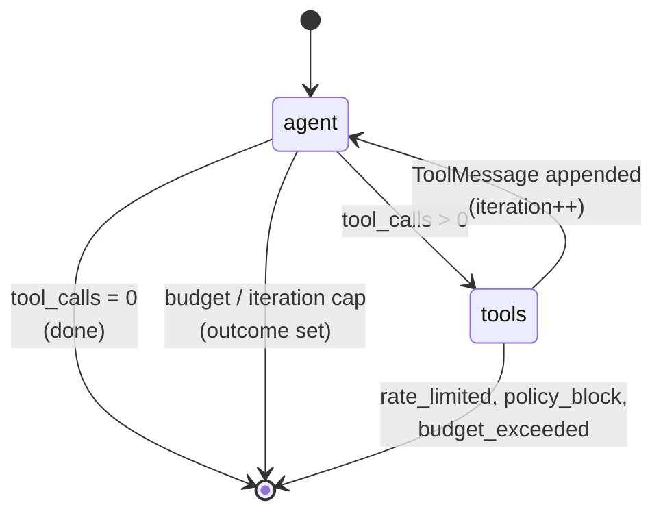

# Agentic runtime

The runtime turns an `AgentDefinition` into work performed against the connected systems. It lives in `@mergecrew/agent-runtime` and is built on **LangGraph.js StateGraph** with a LangChain `BaseChatModel` (resolved per step) at the agent node.

## Goals

- One agent loop, many providers (Anthropic, OpenAI, Bedrock, Ollama).
- Policy-gated tool calls: every tool call goes through a vetted Skill, never raw shell.
- Bounded blast radius: per-step iteration and tool-call ceilings, plus token / USD budgets.
- Rate-limit aware: 429 returns up to the orchestrator (which schedules a wake-up); the runner does not sleep.
- Inspectable: every model turn and tool call is persisted (`ModelTurn`, `ToolCall` rows) plus a transcript blob.

## Anatomy of an Agent

```ts
// packages/domain/src — shape used by the runner
type AgentDefinition = {
  kind: AgentKind;                // e.g., "BackendEngineer"
  systemPrompt?: string;          // role-shaped, optional; falls back to defaultSystemPrompt(kind)
  model?: string;                 // either "capability:..." or a concrete ProviderRef ("anthropic/claude-sonnet-4-6")
  skills: (string | { name: string })[];   // skill names; resolved via SkillExecutor
  doNotTouch?: string[];          // glob patterns checked by PolicyEngine
  maxStepsPerRun?: number;        // default 12
  maxToolCallsPerStep?: number;   // default 8
  budget?: { tokens?: number; usd?: number };
};
```

## Anatomy of a Skill

```ts
// packages/skills/src/types.ts
interface SkillDefinition<I = unknown, O = unknown> {
  name: string;                   // e.g., "repo.write_file"
  description: string;            // shown to the model as the tool description
  inputSchema: Record<string, unknown>;
  outputSchema?: Record<string, unknown>;
  sideEffectClass: SideEffectClass;       // 'read' | 'write_workspace' | 'write_external' | 'irreversible'
  capabilities: SkillCapability[];        // e.g., ['fs.write', 'git.commit']
  timeoutMs?: number;             // default 60_000
  execute(input: I, ctx: SkillExecutionContext): Promise<SkillResult<O>>;
}
```

A `Skill` instance is registered with the `SkillExecutor` at runner startup. The executor enforces the timeout and wraps the call in a composed `AbortSignal`.

## The agent loop

The loop is a LangGraph `StateGraph` with two nodes (`agent`, `tools`) and conditional edges between them. Source: `packages/agent-runtime/src/loop.ts`.



**State** (`packages/agent-runtime/src/loop.ts:60-77`):

```ts
const StateAnnotation = Annotation.Root({
  messages: Annotation<BaseMessage[]>({ reducer: (l, r) => l.concat(r), default: () => [] }),
  toolCallsMade: Annotation<number>({ reducer: (_l, r) => r, default: () => 0 }),
  iteration:     Annotation<number>({ reducer: (_l, r) => r, default: () => 0 }),
  outcome:       Annotation<StepOutcome | null>({ reducer: (_l, r) => r, default: () => null }),
});
```

**Agent node** (`packages/agent-runtime/src/loop.ts:107-171`):

1. Check `abortSignal` and the iteration ceiling (`maxStepsPerRun`).
2. Compute the required `ModelCapability` (`ctx.capabilityFromAgent()`).
3. Ask the `CapabilityRouter` to resolve a `(providerId, modelId)` — honors `agent.model` as an override unless it's a `capability:` requirement.
4. Build a `BaseChatModel` via `registry.buildModel(providerId, modelId, { maxTokens: 4096, temperature: 0.2 })` and call `.bindTools()` with the agent's tool specs.
5. `await bound.invoke(state.messages, { signal: abortSignal })`.
6. Extract `usage_metadata` from the returned `AIMessage`; price it via `priceFor()` + `estimateUsd()`; record a `ModelTurn`; update the budget.
7. On a `rate.?limit|429` error message, return `{ outcome: { kind: 'rate_limited' } }` — never sleep.
8. On any other error, mark the breaker and return `{ outcome: { kind: 'failed', reason } }`.

**Tools node** (`packages/agent-runtime/src/loop.ts:173-248`):

1. Read `tool_calls` off the last `AIMessage`. If empty, return `{}` (the routing edge will go to END).
2. For each tool call:
   - Bump `toolCallsMade`; if it exceeds `maxToolCallsPerStep`, return `tool_call_budget_exhausted`.
   - Call `policy.check(skillName, input)`. If the decision is hard-blocked, return `gated_reject`. If it's soft-blocked, await `onGateRequired()`; on `'rejected'`, return `gated_reject`.
   - Execute the skill via `SkillExecutor.execute()`, wrapping any thrown error into `{ error: msg }`.
   - Persist a `ToolCall` row and emit an `AGENT_TOOL_CALL` timeline event.
   - Append a `ToolMessage(tool_call_id, content)` to the message list.
   - If the budget is now exhausted, return `budget_exhausted`.

**Routing**: after the agent node, go to `tools` if the last message had tool calls, else END. After the tools node, go back to `agent` unless an outcome is already set.

The graph is invoked with `recursionLimit: maxIters * 2 + 4` and the run-level abort signal. If the graph ends without an outcome, the last `AIMessage` text is returned as the completed output.

Key properties:
- **Single-process step.** A step runs to completion within one BullMQ job. If the runner crashes, the orchestrator re-dispatches with idempotent inputs.
- **Rate limits return up.** The runtime never sleeps on a 429; it returns to the orchestrator, which enqueues a delayed `orchestrator.rate-limit.resume`.
- **Capability-aware routing.** `CapabilityRouter.resolve()` skips models whose capabilities don't satisfy the agent's needs (tools, vision, longContext, thinking, etc.).
- **Circuit breaker.** Per `(providerId, modelId)` failure ratios open the breaker for 60s, causing the router to skip that pair on subsequent resolves (`packages/llm/src/circuit-breaker.ts`).
- **Policy intercepts tool calls.** Hard-blocked paths fail immediately; soft-blocked paths (e.g., `**/auth/**`, `**/billing/**`, `**/migrations/**`, agent do-not-touch globs) escalate to a gate.
- **Skills are sandboxed.** `SkillExecutor` enforces a timeout and a composed abort signal (`packages/skills/src/executor.ts:42-55`).

## Provider integration (LangChain)

Each provider is a thin LangChain `BaseChatModel` constructor in `packages/llm/src/models.ts`:

```ts
switch (cfg.kind) {
  case 'anthropic':  return new ChatAnthropic({ apiKey, model, temperature, maxTokens, thinking? });
  case 'openai':     return new ChatOpenAI({ apiKey, model, temperature, maxTokens });
  case 'bedrock':    return new ChatBedrockConverse({ region, model, temperature, maxTokens });
  case 'ollama':     return new ChatOllama({ baseUrl, model, temperature, numPredict });
}
```

Tool specs are passed to LangChain in OpenAI-flavored shape (`{ type: 'function', function: { name, description, parameters } }`); LangChain translates to each provider's native tool format. There is no Mergecrew-specific provider interface — the LangChain `BaseChatModel` is the seam.

The runner builds a fresh `ProviderRegistry` per agent step, so BYOK keys are not retained across requests (`packages/llm/src/registry.ts:9-13`).

## Capability requirements & routing

Agents declare capability or a concrete `ProviderRef`. If `agent.model` starts with `capability:`, the runtime computes `ModelCapability` from the agent kind; otherwise the value is treated as an override `ProviderRef` (e.g., `anthropic/claude-sonnet-4-6`).

`CapabilityRouter.resolve()` (`packages/llm/src/router.ts:28-41`) walks `[override, ...profile.preferenceOrder]`, accepts the first candidate where:

- the provider id is registered;
- the model id is in the provider's allowed list;
- the model's declared capabilities satisfy the request (`satisfies()` checks `tools`, `parallelTools`, `vision`, `embedding`, `thinking`, `promptCache`, `responseJsonSchema`, `lowLatency`, `longContext` ≥);
- the circuit breaker is not open for `${providerId}/${modelId}`.

`ModelCapability` is defined in `packages/domain/src/capability.ts`.

## Skill execution context

```ts
// packages/skills/src/types.ts
interface SkillExecutionContext {
  organizationId: string;
  projectId: string;
  runId?: string;
  changesetId?: string;
  agentStepId?: string;
  workspacePath?: string;
  abortSignal: AbortSignal;
  logger: { info; warn; error };
  emit?: (kind: string, payload: Record<string, unknown>) => Promise<void>;
  adapters: { vcs?; deploy?; tracker?; comms? };
  config?: Record<string, unknown>;
}
```

Skills must:
- Validate inputs against `inputSchema` before doing work.
- Return a `SkillResult<O>` with a `brief` summary used for timeline events.
- Respect `abortSignal` — `SkillExecutor` composes the run-level signal with a per-skill timeout.
- Emit at least one timeline event for any side effect.

## Budgets

Three layered budgets enforced by `BudgetTracker` (`packages/agent-runtime/src/budget.ts`):

- **Per-step.** `maxToolCallsPerStep` (default 8), `maxStepsPerRun` (default 12). Enforced inside the loop.
- **Per-changeset.** Optional `agent.budget.{tokens,usd}` cap. After every model turn (and every tool call for safety) the tracker is consulted; on exhaustion the loop returns `budget_exhausted`.
- **Per-run / per-org.** Hard ceilings tracked outside the runtime; the orchestrator pauses dispatch when they are reached.

## Observability per step

Each agent step produces:

- **`ModelTurn` rows** — one per LLM call. `recordModelTurn()` receives `{providerId, modelId, usage, latencyMs, usdEstimate}`. `usage` is extracted from LangChain's `usage_metadata` (input/output/total tokens plus `cache_read` / `cache_creation` from `input_token_details`).
- **`ToolCall` rows** — one per skill invocation: `{sequence, skillName, input, output, isError, sideEffectClass, startedAt, finishedAt}`.
- **`TimelineEvent`s** — `AGENT_TOOL_CALL` per tool call; agent-step lifecycle events emitted by the runner.
- **Transcript blob** — the message array is captured for replay (object storage).

## Graph profiles: `roster` (default) and `careful` (legacy)

A project's `graphProfile` column selects which orchestration graph the
orchestrator dispatches against:

- **`roster`** (default since #516) — the full 9-agent specialized
  graph: Discovery → PM → Implementation (BackendEngineer + FrontendEngineer)
  → QA → DeployDev (SRE) → Observation (DesignReviewer + Observation +
  BugTriage + DocWriter). QA's `tests_fail` verdict loops back to PM for
  spec revision; the reviewer's `request_changes` loops back to the
  appropriate engineer. New projects boot on this profile.

- **`careful`** (legacy) — the original 3-agent loop: Planner → Coder →
  Reviewer with `request_changes` loop-back to Coder. Kept for
  back-compat; existing projects that booted before #516 still run on
  this profile and continue to work unchanged.

- **`fast`** — single-agent legacy path. V1 behavior.

- **`custom`** — operator-supplied YAML graph in the project's
  `graphYaml` column. Validated against the Graph schema in
  `@mergecrew/domain` on every write.

Operators flip a project between profiles from the Lifecycle page; the
runtime picks the new profile on the next run.

### Migration policy (#528)

When the schema default flipped to `roster` in #516, existing
`careful`-profile projects were intentionally left in place — no
auto-upgrade migration ran. The trade-off (logged in the decision
ticket #528) was option 2: keep `careful` as a legacy profile
alongside `roster`. Pros: zero migration risk and the resolver doesn't
need an alias layer. Cons: doubled maintenance until a future
release decides to auto-upgrade. Operators wanting to move to roster
can flip the profile from Lifecycle settings.

## Replay

A persisted `AgentStep` carries enough context (system prompt + initial input + tool specs + recorded outputs) to re-run offline against a stub model that returns recorded responses, with read-only skills. This makes "what would model X have done?" tractable without re-incurring side effects.
