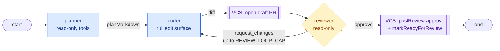

# Multi-agent specialization

V1 ran one monolithic agent per workflow node — that agent planned, coded, and self-reviewed in a single LangGraph loop. V2.ad splits that into three specialized agents that hand off via a graph: **planner**, **coder**, **reviewer**. Each one is cheaper because its context is narrower; the human reviewer (still required for prod) sees fewer rejected diffs because the cheap LLM reviewer catches the obvious ones first.

This page covers when to pick which profile, how the agents hand off, how to write a custom graph, the cost trade-offs, and how to debug a stuck loop.

## The three default agents

| Agent | Tools | Input | Output |
|---|---|---|---|
| **planner** | Read-only (file read, grep, listing) | Lifecycle context + repo snapshot | A markdown plan listing "Files to touch", "Files NOT to touch", "Validation" |
| **coder** | Full edit surface (read/write, shell, git ops) | `planMarkdown` + repo state + optional `reviewerFeedback` | A changeset diff |
| **reviewer** | Read-only | `planMarkdown` + the coder's diff | `VERDICT: approve` or `VERDICT: request_changes` with structured reasoning |

The planner's tool surface is **defensively** filtered to read-only at the runtime level (see [`packages/agent-runtime/src/loop.ts`](../../packages/agent-runtime/src/loop.ts) — `PLANNER_AGENT_KIND` branch). Even if a misconfigured lifecycle YAML binds a write skill to a planner-kind agent, the model never sees the tool. Same for the reviewer.

The coder gets a smaller context than V1's monolithic agent — it doesn't carry the planner's transcript, just the plan markdown. That saves tokens on the most expensive step. Coder steps that touch files outside the plan's "Files to touch" emit an `AGENT_DECISION` event with `kind: out_of_scope_edit`; the reviewer reads those as a hint and tends to flip to `request_changes` even before its LLM call.

## Picking a graph profile

Set this per project: **Settings → Agent graph → fast / careful / custom**. Default is **careful** for new projects (#491) — a freshly-onboarded project has no backlog, so the parallel `fast` fan-out guarantees a broken first run. Projects that existed before the default flip keep whatever the operator chose; operators ready to trade quality for throughput can flip to `fast` from the Lifecycle page.

| Profile | When to pick | Trade-off |
|---|---|---|
| **fast** | Side projects, single-developer codebases, throwaway prototypes | Cheapest, simplest. One agent per node; no reviewer pass; you rely on the human gate for quality. |
| **careful** | Shared codebases, mandatory CI, production gate, anything you'd be embarrassed to revert | ~2–2.5× the cost of fast on average. Fewer human review cycles in exchange — the cheap reviewer catches the obvious mistakes before a human sees them. |
| **custom** | You need a step the defaults don't have (e.g. a separate test-writer between coder and reviewer) | Same as careful plus whatever you add. You own the YAML. |

The `careful` graph definition lives in `@mergecrew/domain/graph-profile.ts` as `CAREFUL_GRAPH`. It's wired identically to a custom YAML — operators who want to fork it can copy + paste it as a starting point.

## Reviewer loop



The draft-PR + reviewer-verdict surfacing is best-effort: a `postReview` failure (auth, draft-unsupported adapter) is logged and the run continues. See [`02-architecture/07-vcs-adapter.md`](../02-architecture/07-vcs-adapter.md#draft-pr--reviewer-verdict-surfacing) for the adapter contract.

The default loop cap is **3 rounds** (one initial coder pass plus up to 2 retries), tunable via `REVIEW_LOOP_CAP`. After exhaustion the run records `REVIEW_LOOP_EXHAUSTED` with the reviewer's last `reasoning` + `requestedChanges` in the event payload, then the workflow advances normally — the changeset surfaces on its existing path (Changesets list / inbox / Slack) with no further coder retries. The timeline event on the run-detail page is where to read what the LLM reviewer was unhappy about.

Each loop round runs the full coder agent, which is expensive. Watch the **Agents** card on the run-detail page: a coder with a `3×` badge tells you the reviewer was unhappy twice. If you see that pattern on many runs, the planner is probably under-specifying — tighten the prompt or use a richer planner model.

## Custom graphs

Pick `custom` on project settings, paste a YAML body. Validated on save.

### Schema

```yaml
version: 1
graph:
  nodes:
    <node-key>:
      agentRef: <name-in-lifecycle-yaml>
    ...
  edges:
    - from: <node-key-or-__start__>
      to: <node-key-or-__end__>
      when: <optional-condition>  # used with conditional dispatch
```

Hard constraints, all enforced by the validator (see `validateGraphDefinition` in `@mergecrew/domain`):

1. Every `from` and `to` must reference a defined node, or use the special `__end__` sentinel as the target.
2. Exactly one node must have no inbound edge — that's the entry point.
3. At least one edge must terminate at `__end__`.
4. Every `agentRef` must exist in the project's lifecycle YAML.
5. No pure cycles without an entry node.

Malformed YAML rejects on save with a clear error.

### Example: plan-then-code (skip the reviewer)

If you want planner's structure without the reviewer's cost:

```yaml
version: 1
graph:
  nodes:
    plan: { agentRef: planner }
    code: { agentRef: coder }
  edges:
    - from: plan
      to: code
    - from: code
      to: __end__
```

### Example: four-agent with a test-writer

If your project's habit is "code first, then tests" and you'd rather invert it:

```yaml
version: 1
graph:
  nodes:
    plan:    { agentRef: planner }
    tests:   { agentRef: test_writer }  # custom agent defined in lifecycle yaml
    code:    { agentRef: coder }
    review:  { agentRef: reviewer }
  edges:
    - from: plan
      to: tests
    - from: tests
      to: code
    - from: code
      to: review
    - from: review
      to: code
      when: requestChanges
    - from: review
      to: __end__
      when: approve
```

`test_writer` is an arbitrary agent kind you define in your project's `mergecrew.yaml` under `agents:`. Use the same kind name in the graph YAML's `agentRef`.

## Cost trade-offs

The fast profile runs one agent. The careful profile runs three. Token math in practice:

- **Planner**: small context (just the lifecycle prompt + repo snapshot). Usually 5-15% of total tokens.
- **Coder**: largest. The plan markdown is much smaller than the planner's full transcript would have been, so even one careful coder step is roughly the same cost as the fast profile's single agent.
- **Reviewer**: small context (plan + diff, no full repo). Usually 10-20% of total tokens unless it loops.

Empirically: careful runs cost **~2-2.5× fast** when the reviewer approves on the first round, **~3-4× fast** when the reviewer loops once, **~5× fast** in the worst-case three-round path.

You can soften the multiplier by routing the planner and reviewer to a cheaper model. Edit the LLM profile's `capabilityRouting` to map `planner` and `reviewer` kinds to a fast-tier model (Haiku, Sonnet, gpt-5-mini) while keeping the coder on the smart-tier model. The cheap reviewer is still much better than no review — its job is catching the obvious mistakes, not subtle ones.

## When the reviewer keeps rejecting

The most common careful-profile pathology: reviewer rejects, coder retries, reviewer rejects again. Usually one of these:

| Symptom | Likely cause | Fix |
|---|---|---|
| Reviewer cites the same `requestedChanges` every round | Coder isn't reading the previous feedback | Check the run-detail timeline: each `REVIEW_CHANGES_REQUESTED` event payload should appear in the next coder step's input. If it's not threaded, that's a runner bug — file an issue. |
| Reviewer flips its mind round-over-round | Reviewer is too smart for its prompt — over-thinking style stuff | Tighten the reviewer's prompt, or set it to a cheaper model that won't second-guess itself. |
| Reviewer flags out-of-scope edits the coder didn't make | Plan's "Files to touch" was too narrow | Re-prompt the planner to include adjacent test files in scope; or expand the "Files to touch" rule to allow `_test.ts` siblings. |
| Reviewer requests changes the plan didn't ask for | Reviewer is acting like a second planner | Tighten its prompt to "decide approve/request_changes, do not propose new work." The default prompt in `REVIEWER_SYSTEM_PROMPT` does this; if you've customized it, check. |

## When the planner is missing files

Symptom: planner's plan lists files unrelated to the bug, or omits the obvious one.

| Likely cause | Fix |
|---|---|
| Planner's tool surface is too narrow — it can't see the file | Confirm the planner's `skills` binding in lifecycle YAML includes at least `repo.read_file` + `repo.list_paths` + `repo.search`. |
| Planner's intent prompt is too vague | The default Discovery → Planner handoff passes the lifecycle's free-form text. If the intent doesn't mention the bug specifically, the planner has to guess. |
| Repo is large enough that the planner can't fit it in context | Switch planner to a long-context model. Or pre-summarize via a Discovery step. |

## When the coder edits out of scope

Symptom: coder's diff touches files the plan said NOT to touch. The runtime emits `AGENT_DECISION` with `kind: out_of_scope_edit`. The reviewer should flip to `request_changes` automatically — if it doesn't, the reviewer is over-eager to approve.

Often the underlying cause is that the planner's plan was vague — e.g. it said "fix the /healthz route" but didn't list `src/routes/health.ts` explicitly under "Files to touch". Tighten the plan structure; the planner's system prompt is in [`packages/agent-runtime/src/loop.ts`](../../packages/agent-runtime/src/loop.ts) as `PLANNER_SYSTEM_PROMPT` if you want to customize.

## Per-agent eval fixtures

Three new fixture kinds land under `packages/eval-fixtures/fixtures/`:

- `planner-finds-the-bug` — planner reads a broken Express handler, must mention `src/routes/health.ts` in its plan.
- `coder-implements-the-plan` — coder receives a pre-baked plan and must produce the right diff while staying inside the listed files.
- `reviewer-flags-out-of-scope` — reviewer sees a diff that touches a file the plan forbade and must `request_changes`.

These fixtures catch regressions at the agent level rather than the loop level. If the planner starts hallucinating files but the coder happens to recover, an end-to-end fixture might still pass while the planner regression is invisible. The agent-isolation fixture catches it.

Read more in [`docs/03-infrastructure/15-evals.md`](15-evals.md).

## Per-kind run budgets

Each stock agent declares a per-step `budget` *and* a cumulative
`runBudget`. `runBudget` caps the kind's total spend across one
workflow run — so two reviewer-driven loop-backs can't drag the run
past its expected ceiling. Stock defaults:

| Kind | per-step (tokens / USD) | run cumulative (tokens / USD) |
|---|---|---|
| Planner | 50k / 0.5 | 50k / 0.5 (single pass) |
| Coder | 200k / 4.0 | 600k / 12.0 (≤ 3 passes) |
| Reviewer | 30k / 0.3 | 90k / 0.9 (≤ 3 passes) |

The runner subtracts the kind's prior `model_turns` spend from the
`runBudget` before constructing the step's `BudgetTracker`, so a step
born into an already-exhausted kind short-circuits to `budget_exhausted`
on the first turn. Operator-defined agents in `mergecrew.yaml` can
override either field — see `packages/domain/src/stock-agents.ts` for
the shape.

## Tunable limits

| Env | Default | What it does |
|---|---|---|
| `REVIEW_LOOP_CAP` | `3` | Max coder passes per careful run before `REVIEW_LOOP_EXHAUSTED` fires and the changeset surfaces to humans without further coder retries. |

## Migration notes

Projects created before #491 kept the **`fast`** default they were assigned at creation time — the migration only flipped the column default for new rows, no UPDATE was issued. Existing operators see no behavior change without an explicit Settings → Agent graph action. Old fixture YAMLs (no `kind:` field) load as `kind: end-to-end`.

Flipping a project to **`careful`** in Settings → Agent graph wires planner → coder → reviewer automatically. The orchestrator falls back to `STOCK_AGENTS_BY_REF` for any of the three kinds the operator hasn't defined in their `mergecrew.yaml`; operator-defined agents with matching agentRefs win over the stock fallback. **`custom`** parses the YAML body, validates it against the project's lifecycle agentRefs at save time, and runs the same chain dispatch (entry node → successor nodes; reviewer verdict drives routing on conditional edges).

## Related

- [`02-architecture/...`](../02-architecture) — the original V1 agent loop, for historical context.
- [Evals](15-evals.md) — agent-isolation fixtures + dashboard.
- [Operator runbook](05-operator-runbook.md) — when a step is stuck mid-loop.
